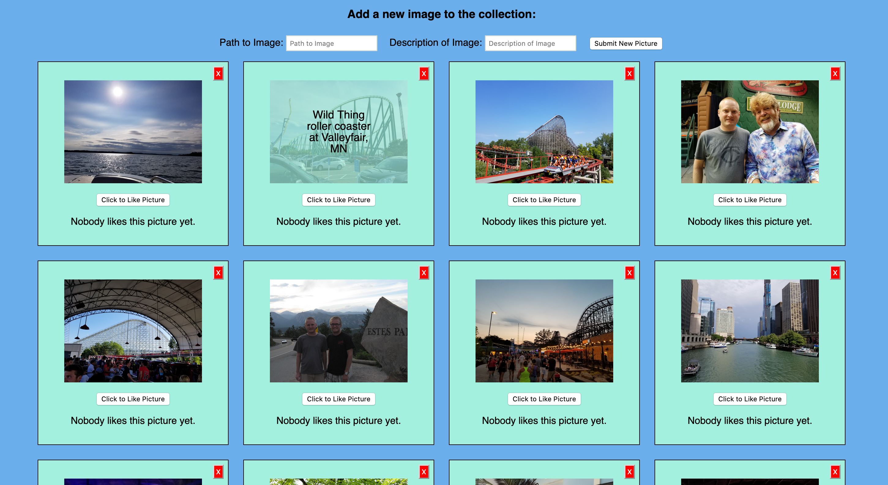

# React Gallery

## Description

Duration: 72 hours - evening 10/22/2020 - evening 10/25/2020

This project is an app to display images that are important to me over the last few years.  It stores the information about them in a database, and uses React to display them on the DOM.  They are able to be 'liked' or completely deleted from the database.  The image may be clicked on to see the description text for it.  Also, a new picture may be added by typing the path to it in the input box, as well as a description in the description box.

The main problem for this project has been using and understanding React.  I tried to figure this out by looking at example apps from lecture and figuring out where certain pieces were being used and how.  I also made slow steps and tried to make things work in the parent component before making a new component.

## Screen Shot

### Prerequisites

- The project requires Node.  It may be downloaded here: https://nodejs.org/en/

- The project requires the creation of a database.  Postgresql was used for this project.  The database is titled react_gallery and a command for creating the "cool_pictures" table is in the database.sql file.  It may be found here: https://www.postgresql.org/.  Postico also may be used to visually see the database.  It is found here: https://eggerapps.at/postico/

- The project requires an understanding of HTML, CSS, JavaScript, React, http requests to a server, queries to a database, and an understanding of pool

## Installation

This project can be forked and cloned from the Github repository.  The command 'npm install' will install the dependancies.  If you do not have nodemon, you may install it with 'npm install nodemon --global'.

A Postgresql database is required.  It needs to be called react_gallery, and the table can be created by copying the contents of the database.sql file into Postico and executing.

In the terminal, enter the command 'npm run server'.  Open a new terminal window, and enter the command 'npm run client'.  This should open the browser and display the initial images from the database.

## Usage

1. The first 20 pictures should display on page load.  At this point, the pictures may be clicked on to see description text.  

2.  The button below the image may be clicked on to increase the number of 'likes' for the image.  

3.  The red button may be clicked to permanently delete the entire image entry.  This cannot be undone.

4.  A new image may be inserted by putting its path into the box above the images, with description text in the right box.  I limited characters to 75 here so they will all fit in the picture when displayed.  There are 5 more entries in the text_entries.txt file that can be copied into the input boxes.

## Built With

- React
- CSS
- Node
- Express
- JavaScript
- HTML
- Postgresql
- Pool
- Axios